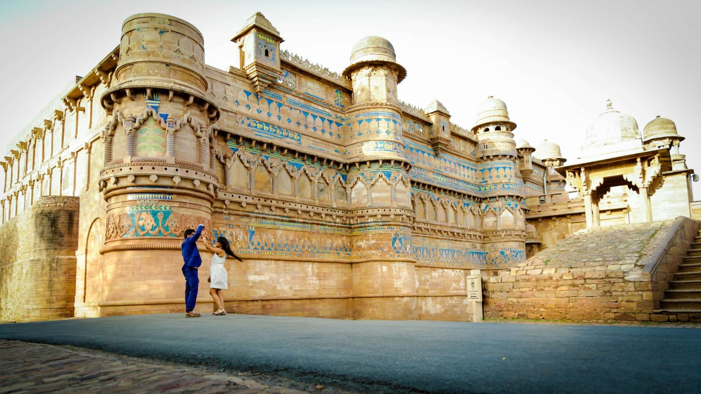
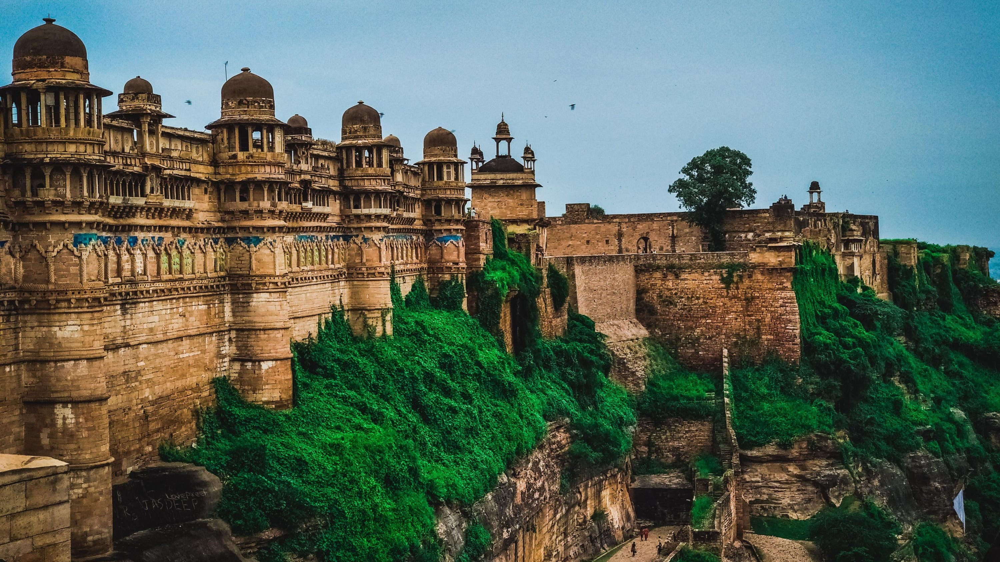
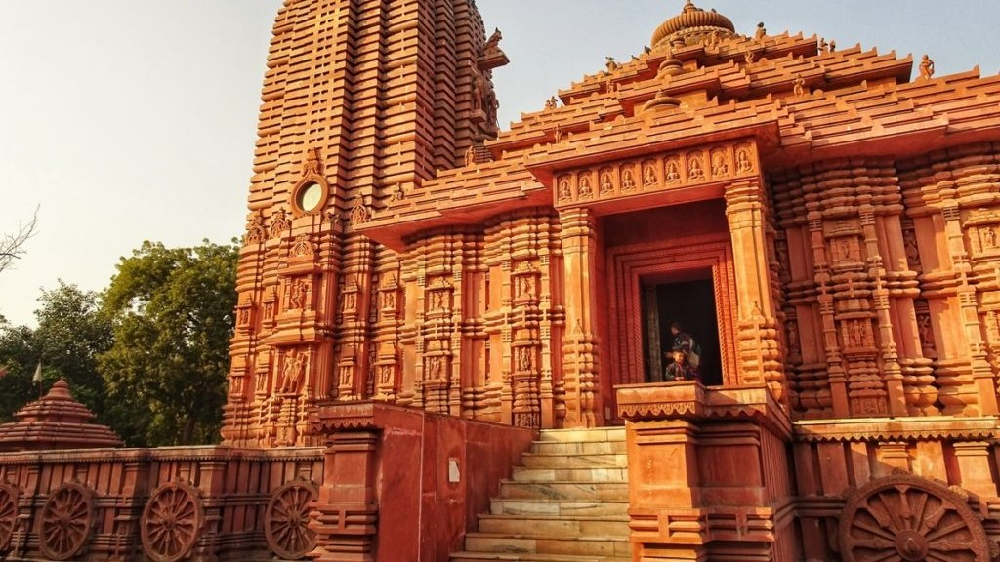
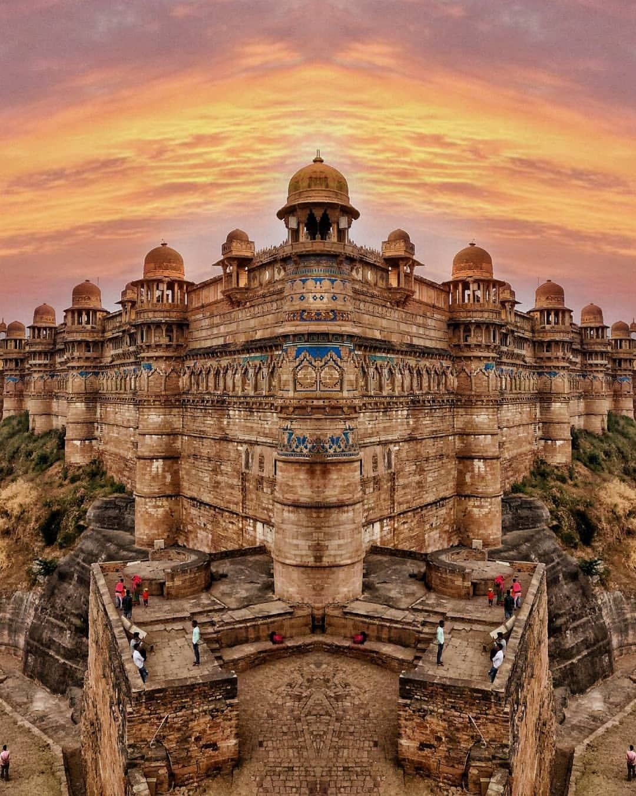
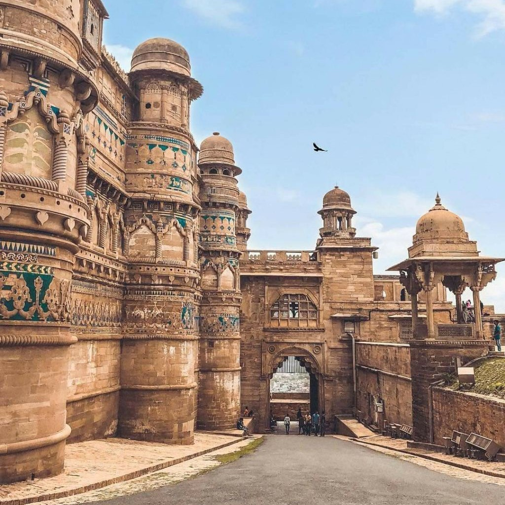
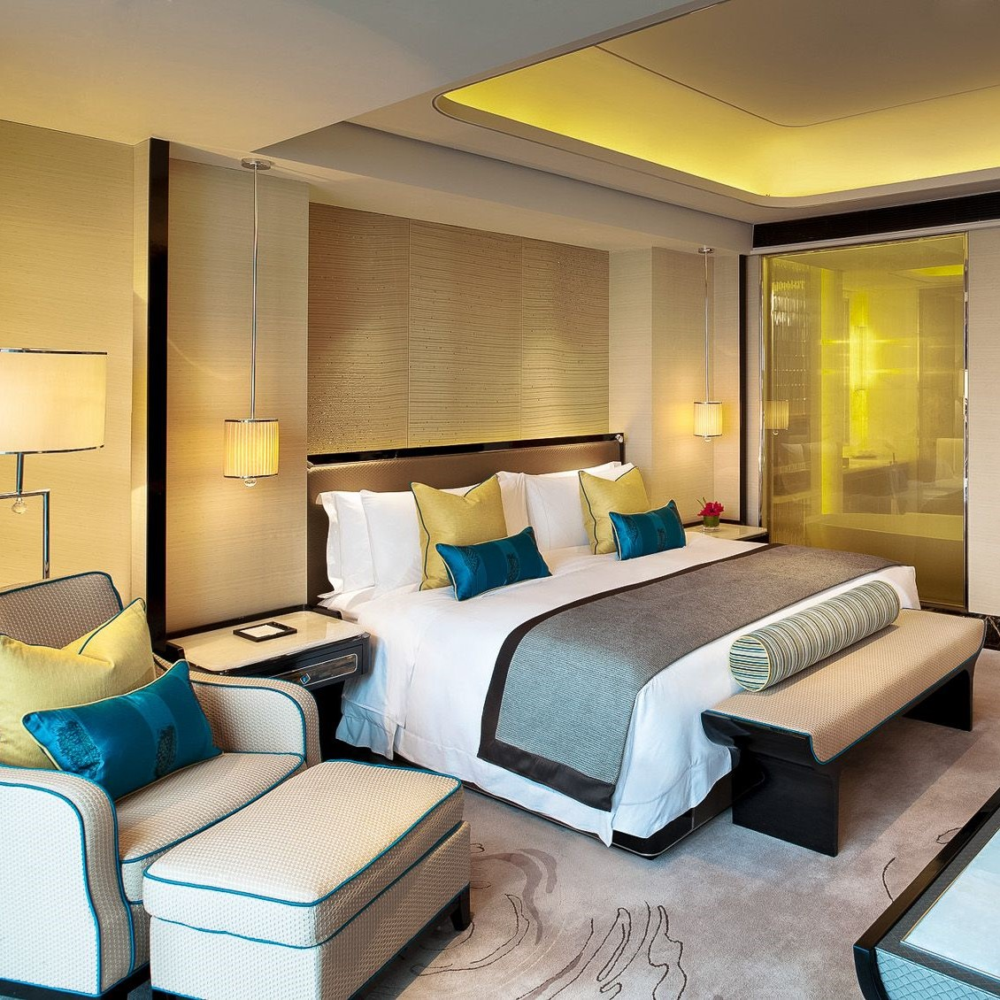
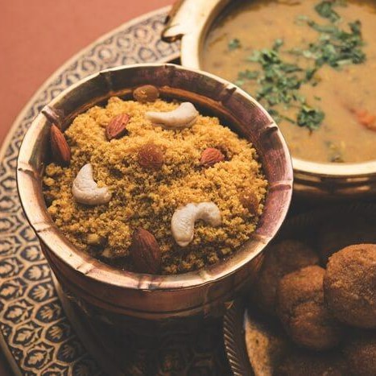

<!DOCTYPE html>
<html>
<head>
	<title></title>
  <meta charset="UTF8">
  <meta name="viewport" content="width=devices-width,initial-scale=1.0">
  <meta http-equip="X-UA-Compaitable" content="ie=edge">
<link rel="stylesheet" type="text/css" href="https://stackpath.bootstrapcdn.com/bootstrap/4.4.1/css/bootstrap.min.css" integrity="sha384-Vkoo8x4CGsO3+Hhxv8T/Q5PaXtkKtu6ug5TOeNV6gBiFeWPGFN9MuhOf23Q9Ifjh" crossorigin="anonymous">
<link rel="stylesheet" type="text/css" href="https://stackpath.bootstrapcdn.com/font-awesome/4.7.0/css/font-awesome.min.css">

<link rel="stylesheet" type="text/css" href="GwlTourism.css">
</head>
<body>

  

    

  
  

  

 <nav class="navbar navbar-expand-lg navbar-light bg-light fixed-top" style=" background-color: #192332 !important; border-top: 10px solid #54c4c1;">
  <a class="navbar-brand" href="#"><b style="color: #fff;">GWALIOR TOURISM</b></a>
  <button class="navbar-toggler" type="button" data-toggle="collapse" data-target="#navbarSupportedContent" aria-controls="navbarSupportedContent" aria-expanded="false" aria-label="Toggle navigation">
    
  </button>
  

    <ul class="navbar-nav mr-auto">
      <li class="nav-item active">
        <a class="nav-link" href="#"><b style="border: 2px solid dodgerblue; padding: 7px;">Home</b>(current)</a>
      </li>
      <li class="nav-item dropdown">
        <a class="nav-link dropdown-toggle" href="ptv.html" id="navbarDropdown" role="button" data-toggle="dropdown" aria-haspopup="true" aria-expanded="false"><b>
          Places To Visit</b>
        </a>
        

          <a class="dropdown-item" href="ptv.html">Gwalior Fort</a>
          <a class="dropdown-item" href="ptv.html">Jai-Vilas palace</a>
          <a class="dropdown-item" href="ptv.html">Gujari Mahal [State Archaeological Museum]</a>
          <a class="dropdown-item" href="ptv.html">Man Mandir palace</a>
          <a class="dropdown-item" href="ptv.html">Tomb of Tansen</a>
          <a class="dropdown-item" href="ptv.html">Teli Ka Mandir</a>
          

          <a class="dropdown-item" href="ptv.html">And Many More....</a>
        

      </li>
      <li class="nav-item">
        <a class="nav-link" href="hotel.html"><b>Hotels</b></a>
      </li>
      <li class="nav-item">
        <a class="nav-link" href="resturant.html"><b>Restaurant</b></a>
      </li>
      <li class="nav-item">
        <a class="nav-link" href="htr.html"><b>How To Reach</b></a>
      </li>
      <li class="nav-item">
        <a class="nav-link" href="contact.html"><b>Contact Us</b></a>
      </li>
    </ul>
    <nav class="navbar navbar-light bg-light"  style=" background-color: #5d5d5d00!important;">
  <form class="form-inline">
    <a href="signlog.html"><button class="btn btn-outline-success" type="button">Sign Up</button><button class="btn btn-sm btn-outline-secondary" type="button">Login</button></a>
    <!-- Button trigger modal -->
  </form>
  

 </nav>

 
 
 
 
 
 

	

		

			
			

				

				<h3><b>Gwalior-Fort</b></h3>
				

			

		

		

			
      

        

        <h3><b>Jai-Vilas Palace</b></h3>
        

      

		

		

			
      

        

        <h3><b>Gwalior-Fort-Front</b></h3>
        

      

		

		

			
      

        

        <h3><b>Gwalior-zoo</b></h3>
        

      

		

		

			
      

        

        <h3></h3>
        

      

		

    

      
      

        

        <h3><b>Sun-Temple</b></h3>
        

      

    

	

        <a href="#bar" class="carousel-control-next" data-slide="next"></a>
        <a href="#bar" class="carousel-control-prev" data-slide="prev"></a>
        <ul class="carousel-indicators">
        	<li data-target="#bar" data-slide-to="0" class="active"></li>
        	<li data-target="#bar" data-slide-to="1"></li>
        	<li data-target="#bar" data-slide-to="2"></li>
        	<li data-target="#bar" data-slide-to="3"></li>
        	<li data-target="#bar" data-slide-to="4"></li>
          <li data-target="#bar" data-slide-to="5"></li>
    

 

  

    

    <h2 style="color: black"><b class="s">WELCOME TO GWALIOR</h2>
      

       
      

        

          

             Gwalior is best known for its imposing hilltop fort, which was famously described as ‘the pearl amongst fortresses in India’. Historically, the city has been the cradle of a number of dynasties that ruled it over the years. Their influence is clearly seen in the many regal structures that dominate the cityscape. In a sense, Gwalior continues to retain a medieval majesty.

             Gwalior holds an unparalleled reputation in Sangeet, and has retained Indian traditions and the wealth of music intact over the years. The Gwalior Gharana is one of the oldest Khayal Gharanas and the one to which most classical Indian musicians can trace the origin of their style. Legendary musicians like Tansen and Baiju Bawara belonged to Gwalior.

             Gwalior also has a rich history in sports, with the wizard of Hockey, Dhyan Chand, belonging to the city.
          

        

        

           
        

      

  

      

  

     
    <h2 style="color: #000"><b class="s">The Fort City Gwalior</h2>
      

       
        

          

          

          

            

               <iframe src="https://www.youtube.com/embed/nFVROO-L9mE" frameborder="0" allow="accelerometer; autoplay; encrypted-media; gyroscope; picture-in-picture" allowfullscreen></iframe>
            

          

        

        

           
        
Gwalior is a city in the central Indian state of Madhya Pradesh. It's known for its palaces and temples, including the Sas Bahu Ka Mandir intricately carved Hindu temple. Ancient Gwalior Fort occupies a sandstone plateau overlooking the city and is accessed via a winding road lined with sacred Jain statues. Within the fort’s high walls is the 15th-century Gujari Mahal Palace, now an archaeological museum. 
        Area: 780 km² Weather: 15°C,Wind NE at 10 km/h,70% Humidity Population: 11.6 lakhs (2011) Avg. winter temperature: 6.6°C (43.9°F) Avg. summer temperature: 40.5°C (104.9°F) 
        

        

        

            
    
 
  
 

  

      
    <h2 style="color: #000"><b class="s">"Tourism Capital Of Madhya Pradesh"
    </h2>
    

      
   

    

  

     
    

      <h5 class="card-title">Places To Visit</h5>
      
Gwalior is a city famous for valour and love for art. Gwalior has forts, temples and many other monuments that remind Hindus of their brave and proud heritage.

    

    

      <small class="text-muted">Last updated 3 mins ago</small>
    

  

  

    
    

      <h5 class="card-title">Hotels</h5>
      
There are a large number of hotels, available at decent prices. The hotels listed with online offer a wide range of services to make your trip hassle-free, and you can make your booking before you reach the venue.

    

    

      <small class="text-muted">Last updated 3 mins ago</small>
    

  

  

     
    

      <h5 class="card-title">Food And Restaurant</h5>
      
Visiting Gwalior is not just about history but about food too.Food of Gwalior is known for its elaborate breakfast consisting of kachoris, Samosas, Poha and bedai Among the local Madhya Pradesh cuisine

    

    

      <small class="text-muted">Last updated 3 mins ago</small>
    

  

        

 
 

  

   <h2 style="color: #000"><b class="s">"Explore "Gwalior
    </h2>
    

     
     
<iframe  width="100%" height="500" frameborder="0" style="border:0;"src="https://www.google.com/maps/embed?pb=!1m18!1m12!1m3!1d114542.8186404311!2d78.12068716826933!3d26.214138801485987!2m3!1f0!2f0!3f0!3m2!1i1024!2i768!4f13.1!3m3!1m2!1s0x3976c5d1792291fb%3A0xff4fb56d65bc3adf!2sGwalior%2C%20Madhya%20Pradesh%2C%20India!5e0!3m2!1sen!2sus!4v1578249490863!5m2!1sen!2sus" allowfullscreen=""></iframe>

<!-- Footer -->
<footer class="page-footer font-small blue-grey lighten-5" style="background-color: darkslategray;">
  

    

      <!-- Grid row-->
      

        <!-- Grid column -->
        

          <h6 class="mb-0">Get connected with us on social networks!</h6>
        

        <!-- Grid column -->

        <!-- Grid column -->
        

          <!-- Facebook -->
          <a class="ic" href="https://www.facebook.com/people/Anmol-Sharma/100004621953711">
           <i class="fa fa-facebook-official" aria-hidden="true"></i>
          </a>
          <!-- Twitter -->
          <a class="ic" href="https://twitter.com/AnmolSh31767158">
            <i class="fa fa-twitter" aria-hidden="true"></i>
          </a>
          <!-- Google +-->
          <a class="ic" href="">
           <i class="fa fa-google-plus" aria-hidden="true"></i>
          </a>
          <!--Linkedin -->
          <a class="ic" href="https://www.whatsapp.com">
            <i class="fa fa-whatsapp" aria-hidden="true"></i>
          </a>
          <!--Instagram-->
          <a class="ic" href="https://www.instagram.com/anmol_1998cool/">
            <i class="fa fa-instagram" aria-hidden="true"></i>
          </a>

        

        <!-- Grid column -->

      

      <!-- Grid row-->

    

  

  <!-- Footer Links -->
  

    <!-- Grid row -->
    

      <!-- Grid column -->
      

        <!-- Content -->
        <h6 class="text-uppercase font-weight-bold" style="color: #7fffc8">Gwalior Tourism</h6>
        

        
A culturally rich city with all things beautiful, Gwalior has had a glorious history with prominent dynasties ruling the region in the past. With all its forts and palaces and parks and museums, Gwalior is definitely worth a visit! 

      

      <!-- Grid column -->
      

      <!-- Grid column -->
      

        <!-- Links -->
        <h6 class="text-uppercase font-weight-bold" style="color: #7fffc8">Useful links</h6>
        

            
           <a class="dark-grey-text" href="ptv.html"># Places To Visit</a>
            
            
           <a class="dark-grey-text" href="hotel.html"># Hotels</a>
             
             
           <a class="dark-grey-text" href="food.html"># Food & Restaurant</a>
             
             
           <a class="dark-grey-text" href="#!"># How To Reach</a>
        
      

      <!-- Grid column -->
       

      <!-- Grid column -->
      

        <!-- Links -->
        <h6 class="text-uppercase font-weight-bold" style="color: #7fffc8">Contact</h6>
        

        

          <i class="fa fa-home mr-3" ></i> Gwalior, Madhya Pradesh

           
        

        <i class="fa fa-envelope-square"></i>anmol1998cool@gmail.com

         
        

          <i class="fa fa-phone" aria-hidden="true"></i> +91 9131664706

      

      <!-- Grid column -->

    

    <!-- Grid row -->

  

    <!-- Footer Links -->
  

    <!-- Grid row -->
    

      <!-- Grid column -->
      

        <!-- Content -->
        <h6 class="text-uppercase font-weight-bold" style="color: #7fffc8">Gwalior Tourism</h6>
        

        
A culturally rich city with all things beautiful, Gwalior has had a glorious history with prominent dynasties ruling the region in the past. With all its forts and palaces and parks and museums, Gwalior is definitely worth a visit! 

      

      <!-- Grid column -->
      

      <!-- Grid column -->
      

        <!-- Links -->
        <h6 class="text-uppercase font-weight-bold" style="color: #7fffc8">Useful links</h6>
        

            
           <a class="dark-grey-text" href="ptv.html"># Places To Visit</a>
            
            
           <a class="dark-grey-text" href="hotel.html"># Hotels</a>
             
             
           <a class="dark-grey-text" href="food.html"># Food & Restaurant</a>
             
             
           <a class="dark-grey-text" href="#!"># How To Reach</a>
        
      

      <!-- Grid column -->
       

      <!-- Grid column -->
      

        <!-- Links -->
        <h6 class="text-uppercase font-weight-bold" style="color: #7fffc8">Contact</h6>
        

        

          <i class="fa fa-home mr-3" ></i> Gwalior, Madhya Pradesh

           
        

        <i class="fa fa-envelope-square"></i>anmol1998cool@gmail.com

         
        

          <i class="fa fa-phone" aria-hidden="true"></i> +91 9131664706

      

      <!-- Grid column -->

    

    <!-- Grid row -->

  

  <!-- Footer Links -->
  <!-- Copyright -->
  

    <a style="color: white;">© Tourism @ 2020 :</a>
    <a class="dark-grey-text" href="#">GwlTourism.com</a>
  

  <!-- Copyright -->

</footer>
<!-- Footer -->
</body>
</html>

